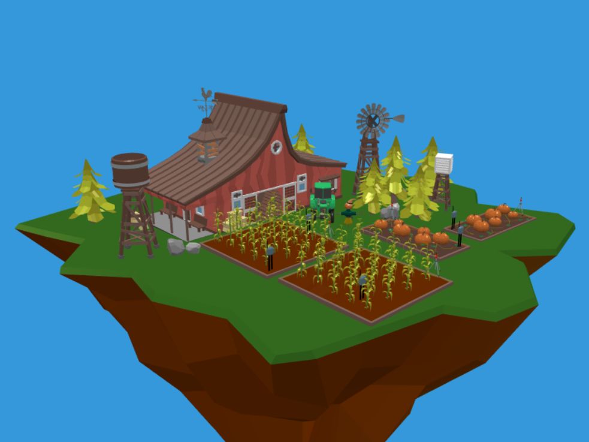

# WoT Farm Simulator
This project is a simple simulation of a digital farm. It can be used as a playground to understand how the Web Of Thing works.

## RoadMap 
- Fronted:
    - [x] first rendering of the farm
    - [ ] Modify the base 3d model of the farm to be more "usable"
    - [ ] Skybox rendering
    - [x] connect fronted with the simulated web things
    - [ ] add animations
    - [ ] add a code editor to write user defined scripts
    - [ ] add interface for user private simulations
- Backend
    - [ ] Add unit tests
    - [ ] Add a discovery service
    - [ ] Create user private simulations
    - [ ] save simulation state
    - [ ] weather service

### Reference
[3D model](https://sketchfab.com/3d-models/low-poly-farm-v2-0e91a96ca6ee44569cf94972e30b5be4)